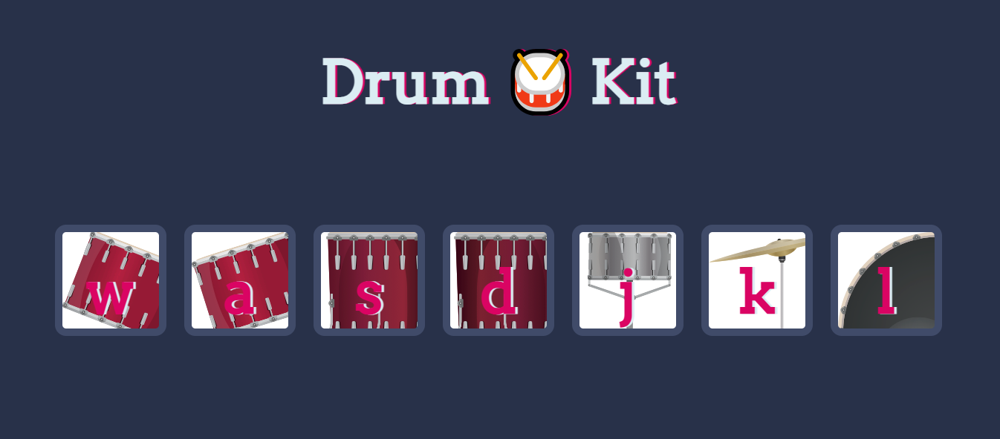

# 🥁 Drum Kit — Interactive Web Music Toy

A simple, fun, and interactive **drum kit web app** where you can press keys or click buttons to play drum sounds! Built using **HTML5**, **CSS3**, **JavaScript**, and a dash of **jQuery** for event handling magic.

---

## 🌐 Live Demo

🚀 [Check it out here!](https://rajveer-singh8124.github.io/Drum-Kit/)  

---

## 📸 Preview

  

---

## ✨ Features

- Click buttons or press keys (`w`, `a`, `s`, `d`, `j`, `k`, `l`) to play drum sounds.
- Visual button press animation for each key.
- Smooth, responsive layout.
- Simple footer branding.

---

## 🛠️ Built With

- **HTML5**
- **CSS3**
- **JavaScript**
- **jQuery 3.7.1**
- **Google Fonts (Arvo)**

---

